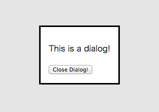

## ご存じですか、dialog要素

[@GeckoTang](http://twitter.com/GeckoTang)

---

## GeckoTang


- げこたん [Twitter](http://twitter.com/GeckoTang)  [GitHub](https://github.com/geckotang)
- [株式会社ピクセルグリッド](http://www.pxgrid.com/)
- フロントエンド・エンジニア
- 自称CSSプログラマ
- [CSS Panic](https://developer.mozilla.org/ja/demos/detail/css-panic)
- [惚れさせ男子 for Alfred 2](https://github.com/geckotang/alfred-horesase-workflow)
- [突然のAlfred for Alfred 2](https://github.com/geckotang/alfred-suddendeath-workflow)

---

## dialog要素とは

> dialog 要素はページ内ダイアログ機能を提供します。ダイアログは DOM ツリー内に存在し、通常の CSS でスタイリングすることができます。
> http://demo.agektmr.com/dialog/

- Chrome Canaryで使える
- HTMLなのでCSSで見た目を自由に当てられる
- 表示/非表示はJavaScriptで行う
- z-indexとは違う重なり順になるので、必ず最前面に出る

---

## 使い方

1. ダイアログを表示する
2. モーダルを表示する

------

### ダイアログを表示する

```html
<dialog>
  <p>This is da dialog!</p>
  <button id="close">Close</button>
</dialog>
<button id="show">Open Dialog!</button>
```

```js
var dialog = document.querySelector('dialog');
document.querySelector('#show').onclick = function() {
  //dialog要素がshowという専用メソッドを持っている
  dialog.show();
};
document.querySelector('#close').onclick = function() {
  //dialog要素がcloseという専用メソッドを持っている
  dialog.close();
};
```

[Demo](http://codepen.io/geckotang/pen/GvqcJ)

------

### モーダルを表示する

```html
<dialog>
  <p>This is a dialog!</p>
  <button id="close">Close Dialog!</button>
</dialog>
<button id="show">Open Dialog!</button>
```

```javascript
var dialog = document.querySelector('dialog');
document.querySelector('#show').onclick = function() {
  //show()からshowModal()に変更した
  dialog.showModal();
};
document.querySelector('#close').onclick = function() {
  dialog.close();
};
```

[Demo](http://codepen.io/geckotang/pen/xbhiB)

Escで消すことができる

---

## 気づいたこといくつか

1. 見た目
2. open属性
3. 表示位置
4. 特殊な擬似要素

------

### 1.見た目

デフォルトであたっているCSSはとても<del datetime="2014-08-17T02:46:25 +0900">残念</del>シンプル



なので、dialog要素の位置や見た目などはCSSで自分で調整すること

------

### 2.open属性

showまたはshowModal()によって、dialog要素にopen属性が追加される

```html
<dialog>
  <p>This is a dialog!</p>
</dialog>
```

↓dialog.show()

```html
<dialog open>
  <p>This is a dialog!</p>
</dialog>
```

↓dialog.close()

```html
<dialog>
  <p>This is a dialog!</p>
</dialog>
```

------

### 3.表示位置

showModal()で呼び出したdialog要素は、垂直中央に表示される

```css
dialog {
  position: absolute;
  left: 0px;
  right: 0px;
  width: -webkit-fit-content;
  height: -webkit-fit-content;
  margin: auto;
  /* 略 */
}
```

------

### 4.特殊な擬似要素

showModal()で呼び出した時のオーバーレイは、dialog::backdrop擬似要素という特殊なもの

```css
dialog::backdrop {
  position: fixed;
  top: 0px;
  right: 0px;
  bottom: 0px;
  left: 0px;
  background: rgba(0, 0, 0, 0.0980392);
}
```

- show()で呼び出した時は、dialog::backdropはでない
- ちなみに、::before/afterのように、DevToolのElementsで見つけることはできない（14/8/17現在）

---

## dialog要素が持つイベント

- close
- cancel

------

### close

dialog.close()した時に発生する。

```javascript
var dialog = document.querySelector('dialog');
document.querySelector('#show').onclick = function() {
  dialog.showModal();
};
document.querySelector('#close').onclick = function() {
  dialog.close('hoge');
};

dialog.addEventListener('close', function(){
  console.log('close', this.returnValue);
});
```

``dialog.close(値)``は、``dialog.returnValue``として取れる。

[Demo](http://codepen.io/geckotang/pen/BeAbC)

------

### cancel

showModal()した後に、``Esc``キーを押すと発生する。

```javascript
var dialog = document.querySelector('dialog');
document.querySelector('#show').onclick = function() {
  dialog.showModal();
};
document.querySelector('#close').onclick = function() {
  dialog.close('hoge');
};

dialog.addEventListener('cancel', function(){
  console.log('cancel');
});
```

[Demo](http://codepen.io/geckotang/pen/HbdIn)

------

### cancel の補足

```javascript
var dialog = document.querySelector('dialog');
document.querySelector('#show').onclick = function() {
  dialog.showModal();
};
document.querySelector('#close').onclick = function() {
  dialog.close('hoge');
};

dialog.addEventListener('cancel', function(){
  this.returnValue = 'fuga';
  console.log('cancel');
});
dialog.addEventListener('close', function(){
  console.log('close', this.returnValue);
});
```

``Esc``によるキャンセルをすると、cancel -> closeの順でイベントが起こる

[Demo](http://codepen.io/geckotang/pen/tnxJp)

------

### Escの動作を止める

``Esc``を押した時に、モーダルを閉じたくない場合は、

```
dialog.addEventListener('cancel', function(e){
  e.preventDefault();
  console.log('cancel');
});
```

のようにすると、cancelで止まり、closeは発生しない。

---

## dialog要素にアニメーションを付ける

------

### dialogが開くときにアニメーション

- dialog.show()すると、dialog要素にopen属性が付与され表示される。
- しかし、display: none;をdisplay:block;にするような動作なので、transitionとかはできない。
- なのでanimationを使うことにした。

```javascript
var dialog = document.querySelector('dialog');
document.querySelector('#show').onclick = function() { dialog.show(); };
document.querySelector('#close').onclick = function() { dialog.close(); };
```

```css
dialog[open] { -webkit-animation: show 1s ease normal; }
@-webkit-keyframes show{
    from { transform: translateY(-110%); }
    to { transform: translateY(0%); }
}
```

[Demo](http://codepen.io/geckotang/pen/FLfqv)

------

## dialogが閉じるときにも

- dialog.close()を呼ぶとopen属性が削除されすぐ消えちゃう。
- なので、dialogに閉じるときのクラスを付与してanimation
- animationEndで付与したクラスを削除し、dialog.close()する

```javascript
document.querySelector('#close').onclick = function() {
    dialog.classList.add('hide');
    dialog.addEventListener('webkitAnimationEnd', function(){
        dialog.classList.remove('hide');
        dialog.close();
        dialog.removeEventListener('webkitAnimationEnd',  arguments.callee, false);
    }, false);
};
```

```css
dialog[open] { -webkit-animation: show 1s ease normal; }
dialog.hide { -webkit-animation: hide 1s ease normal; }
@-webkit-keyframes show{ from { transform: translateY(-110%); } to { transform: translateY(0%); } }
@-webkit-keyframes hide{ to { transform: translateY(-110%); } }
```

[Demo](http://codepen.io/geckotang/pen/DvLkw)

------

## 背景のオーバーレイにも...

- 先ほど閉じるときに.hideを付与してanimationさせたので、
- ``[open]::backdrop``と``.hide::backdrop``にanimationを指定すれば良い。

```css
.dialog[open]::backdrop { -webkit-animation: show-backdrop 0.5s ease 0.2s normal; }
.dialog.hide::backdrop { -webkit-animation: hide-backdrop 0.5s ease 0.2s normal; }
@-webkit-keyframes show-backdrop {
    from { opacity: 0; }
    to { opacity: 1; }
}
@-webkit-keyframes hide-backdrop{
    to { opacity: 0; }
}
```

[Demo](http://codepen.io/geckotang/pen/KmGkL)

---

## まとめ

dialog要素とdialog::backdrop擬似要素はz-indexとは違うレイヤーに配置されるので、呼び出されたものが、必ず前面にくる。そこがいい。

### そこがdialog要素を使う一番のメリット。

### さようならz-index: 2147483647;

ちゃんと、ブラウザに実装されればね。

---

## 参考

- [dialog element demo](http://demo.agektmr.com/dialog/)
- [``<dialog>`` with animation](http://codepen.io/geckotang/blog/dialog-with-animation)
- [Chrome37でHTML5のDialog要素を試してみた](http://qiita.com/nobuhito@github/items/f460043f2b70ca32b0d7)

---

## ご清聴ありがとうございました。
